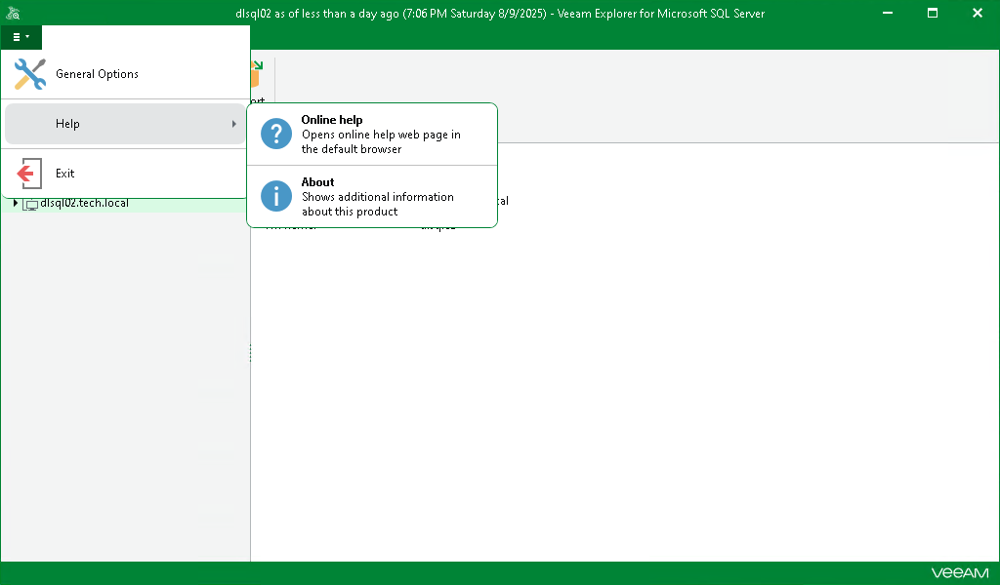
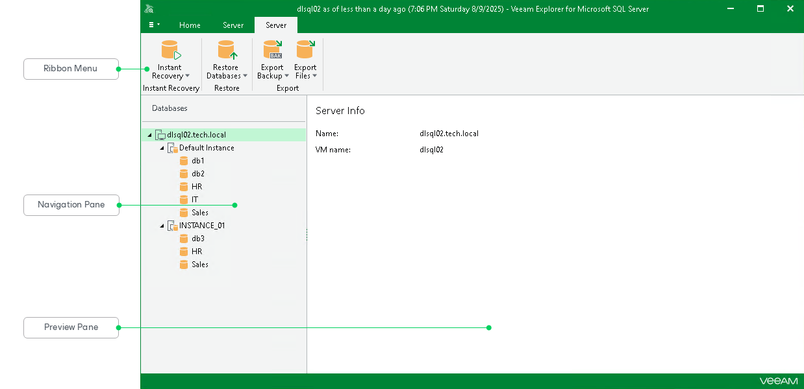

# Getting to Know User Interface

Veeam Explorer for Microsoft SQL Server provides you with a convenient user interface that allows you to perform the required operations in a user-friendly manner.

Main Menu

The main menu comprises the following options:

* General Options. Allows you to configure general application settings.
* Help.

* Online help. Opens the online help page.
* About. Shows additional information, including build number.

* Exit. Closes the Veeam Explorer for Microsoft SQL Server window.

|  |
| --- |
| Tip |
| To open online help, press [F1] in any Veeam Explorer for Microsoft SQL Server wizard or window. You will then be redirected to the relevant section of the user guide. |

Main Application Window

The main application window contains the following UI elements:

* The ribbon menu, which contains general program commands organized into logical groups.
* The navigation pane, which allows you to browse through the hierarchy of your SQL databases.
* The preview pane, which shows you the details about objects you have selected in the navigation pane.

