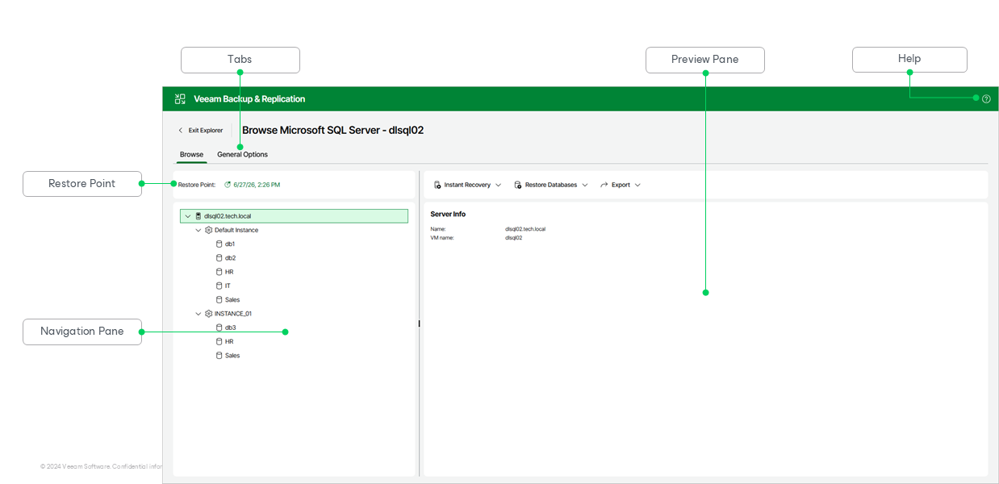

# Getting to Know Explorer Web UI

Veeam Explorer for Microsoft Active Directory provides you with a convenient user interface that allows you to perform required operations in a user-friendly manner.

The main window contains the following UI elements:

* The Browse tab, which allows you to browse the hierarchy of objects in the backup. This tab contains the following elements:

* The Restore Point section, which shows the restore point you are browsing. To browse a different restore point, click the timestamp. For more information, see [Selecting Restore Point](vesql_selecting_restore_point_web_ui.md).

* The navigation pane, which allows you to browse through the hierarchy of SQL Server instances and databases.
* The preview pane, which shows details about the object selected in the navigation pane. In its upper section, the preview pane contains commands you can apply to the databases selected in the navigation pane.

* The General Options tab, which allows you to configure general application settings. For more information, see [General Application Settings](vesql_settings_web_ui.md).
* The Help button, which opens the online help.

Page updated 2026-07-09

