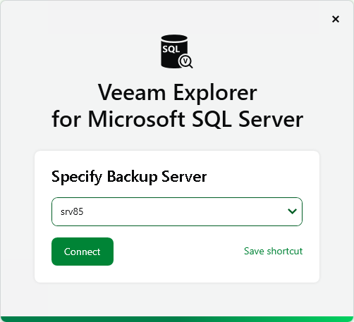
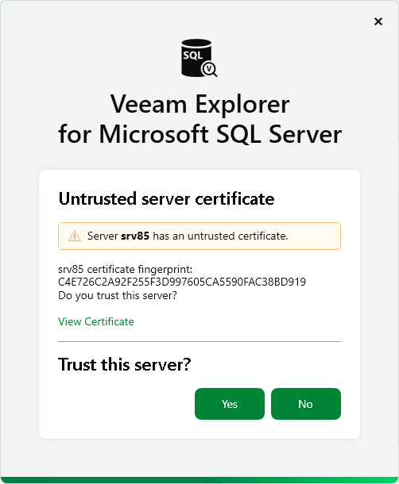

# Launching Application and Exploring Backups

In this article

To open Veeam Explorer for Microsoft SQL Server and load SQL data, you can use either of the following methods:

* Use the Restore application item option to load SQL data from a restore point created by Veeam Backup & Replication.

For more information, see [Application Item Restore](restore_veeam_explorers.md).

* Use the Start menu method to manually open Microsoft SQL databases, as described in the [Adding Standalone Databases](vesql_add_database.md) section.

To launch the application, go to Start, click Veeam Explorer for Microsoft SQL Server and perform the following steps:

1. At the Specify Backup Server step, type the DNS name or IP address of the backup server you want to use or select it from the list of recent connections. To save the connection shortcut to the desktop, click Save shortcut in the bottom-right corner.

Click Connect.

1. When you are connecting to the backup server for the first time, Veeam Explorer for Microsoft SQL Server will ask you to validate the backup server certificate fingerprint. Click View Certificate to see more details about the imported certificate.

Click Yes to install the certificate on the machine where you are launching Veeam Explorer for Microsoft SQL Server.

1. At the Sign in step, enter the credentials of the user account that you want to use to connect to the backup server. For more information on the required permissions for the user, see [Permissions](vesql_permissions.md).

Select the Remember me check box if you do not want to enter the credentials again the next time you sign in to this backup server.

Click Sign in.

Alternatively, select Sign in as current user to use the credentials of the Windows user account currently signed in on the machine where you are launching Veeam Explorer for Microsoft SQL Server.

In This Section

* [Getting to Know User Interface](vesql_know_ui.md)
* [How Mounting Works](vesql_mount_operations.md)
* [Deploying Persistent and Non-Persistent Components](vesql_restore_service.md)
* [Viewing Database Information](vesql_view_db_info.md)

Page updated 11/14/2025

Page content applies to build 13.0.1.1071
