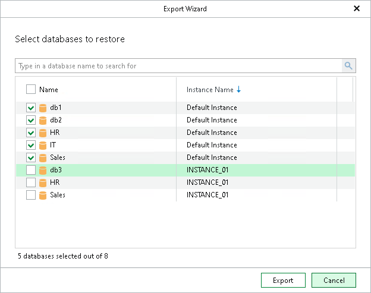

# Step 2. Select Databases

In this article

At this step of the wizard, select the necessary databases and click Export.

To quickly find the necessary databases, use the search field or sort the databases by name. If the databases belong to multiple instances, you can also sort the databases by instance name.

Page updated 9/25/2024

Page content applies to build 13.0.1.1071
