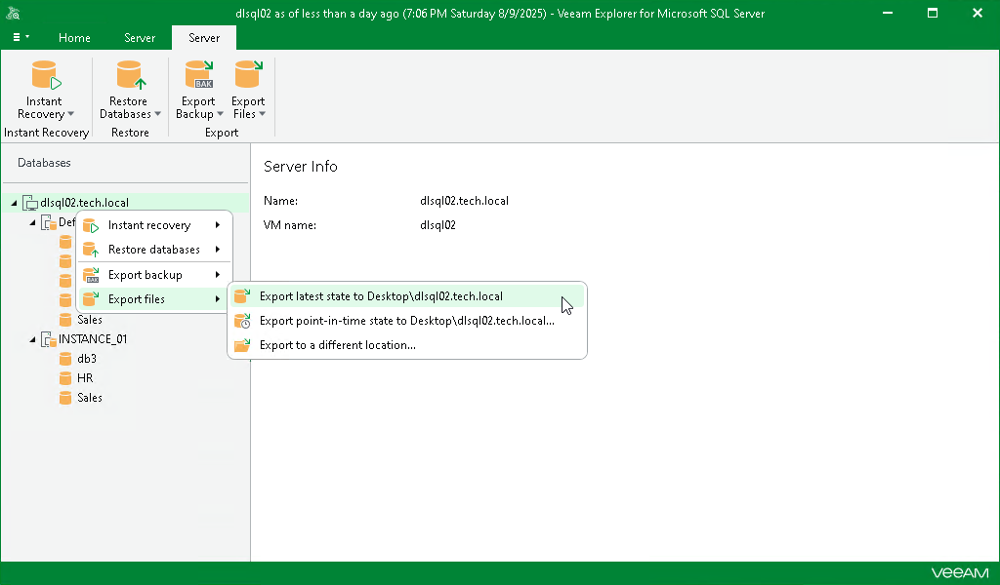

# Step 1. Launch Export Wizard

In this article

To launch the Export wizard, do the following:

1. In the navigation pane, select an instance or the server.
2. On the Instance or Server tab, select Export Files > Export latest state to Desktop\<server\_name>.

Alternatively, you can right-click an instance or the server and select Export files > Export latest state to Desktop\<server\_name>.

|  |
| --- |
| Note |
| The name of the export option depends on the restore point you select during the [application item restore](restore_veeam_explorers.md) process in the Veeam Backup & Replication console.   * If you select the most recent available restore point, the option name is displayed as Export latest state to Desktop\<server\_name>. * If you select any other restore point, the option name is displayed as Export state of <point\_in\_time> to Desktop\<server\_name>. |

Page updated 11/12/2025

Page content applies to build 13.0.1.1071
