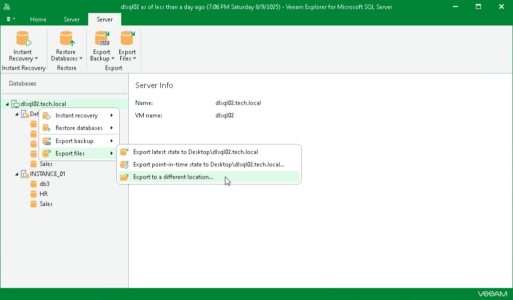

# Step 1. Launch Export Wizard

To launch the Export wizard, do the following:

1. In the navigation pane, select an instance or the server.
2. On the Instance or Server tab, select Export Files > Export to a different location.

Alternatively, you can right-click an instance or the server and select Export files > Export to a different location.

