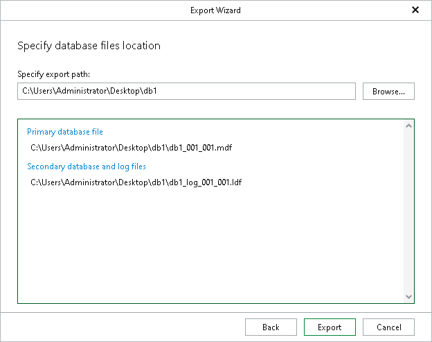

# Step 4. Specify Export Location

At this step of the wizard, specify a path to the directory where you want to export database files and click Export.

Click Browse to specify the path manually.

|  |
| --- |
| Note |
| The account you are using must have a sufficient permission level to access the selected directory (Read and Write as minimum recommended). |

