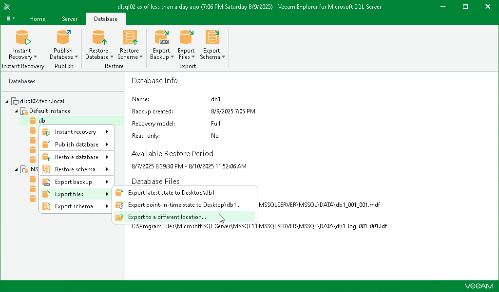

# Step 1. Launch Export Wizard

In this article

To launch the Export wizard, do the following:

1. In the navigation pane, select a database.
2. On the Database tab, select Export Files > Export to a different location.

Alternatively, you can right-click a database and select Export files > Export to a different location.

Page updated 8/10/2025

Page content applies to build 13.0.1.1071
