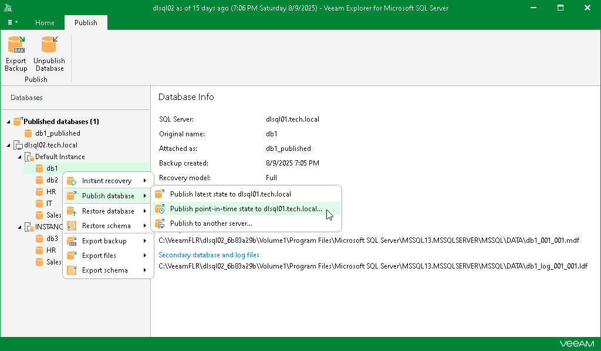

# Step 1. Launch Publish Database Wizard

In this article

To launch the Publish Database wizard, do the following:

1. In the navigation pane, select a database.
2. On the Database tab, select Publish Database > Publish point-in-time state to <target\_server>.

Alternatively, you can right-click a database and select Publish database > Publish point-in-time state to <target\_server>.

Once the publishing process is completed, the database will be published with the same name as during the [initial](vesql_publishing_databases.md) publishing session.

Page updated 8/24/2025

Page content applies to build 13.0.1.1071
