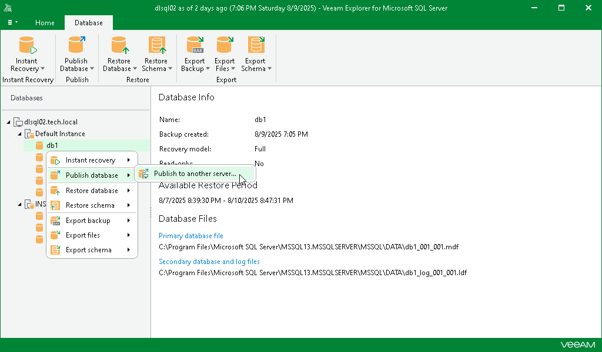
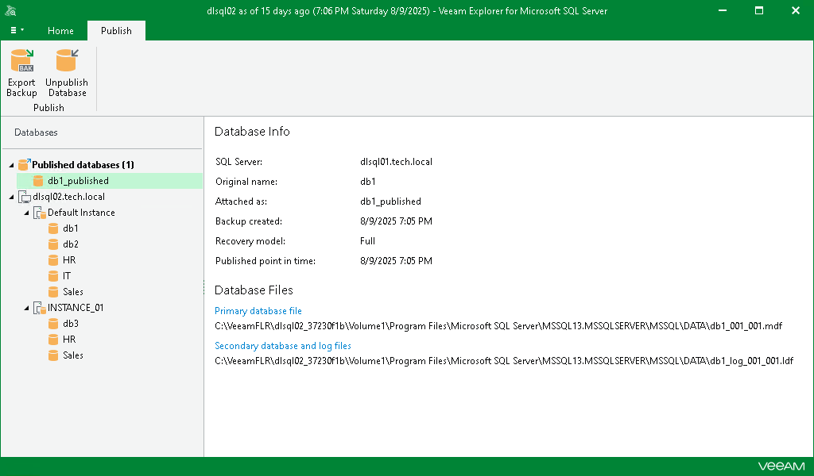
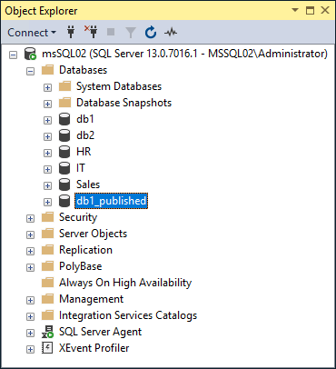

# Step 1. Launch Publish Database Wizard

In this article

To launch the Publish Database wizard, do the following:

1. In the navigation pane, select a database.
2. On the Database tab, select Publish Database > Publish to another server.

Alternatively, you can right-click a database and select Publish database > Publish to another server.

After you complete the wizard steps, a new Published databases node appears at the top of the navigation pane. Under this node, you can find the databases that have been published during the current session of Veeam Explorer for Microsoft SQL Server.

To work with published databases, open a SQL tool you prefer, for example, Microsoft SQL Management Studio and locate your published databases.

The figure below demonstrates a published database (db1\_published) available in the Object Explorer window of your Microsoft SQL Server Management Studio console. This database is also being referenced by Veeam Explorer for Microsoft SQL Server under its Published databases node.

Page updated 8/25/2025

Page content applies to build 13.0.1.1071
