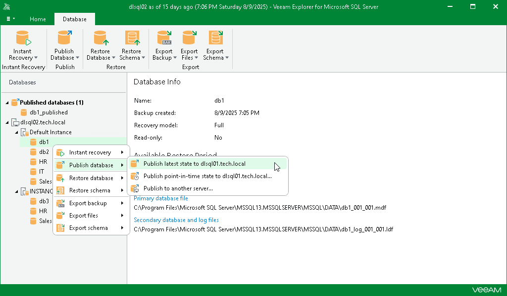

# Publishing Latest State

Veeam Explorer for Microsoft SQL Server allows you to republish an unpublished database. When republishing a database, it will be attached to the target SQL server as of the latest state.

To republish a database as of the latest available state, do the following:

1. In the navigation pane, select a database.
2. On the Database tab, select Publish Database > Publish latest state to <target\_server>.

Alternatively, you can right-click a database and select Publish database > Publish latest state to <target\_server>.

|  |
| --- |
| Note |
| The name of the publish option depends on the restore point you select during the [application item restore](restore_veeam_explorers.md) process in the Veeam Backup & Replication console.   * If you select the most recent available restore point, the option name is displayed as Publish latest state to <target\_server>. * If you select any other restore point, the option name is displayed as Publish state of <point\_in\_time> to <target\_server>. |

Once this process is completed, the database will be published with the same name as during the [initial](vesql_publishing_databases.md) publishing session.

After the publishing process is complete, review the results shown in the Databases publish summary window. To do this, click See more to expand the window and review details of the publishing operation.

You can filter notifications by their status: Error, Warning or Success.

