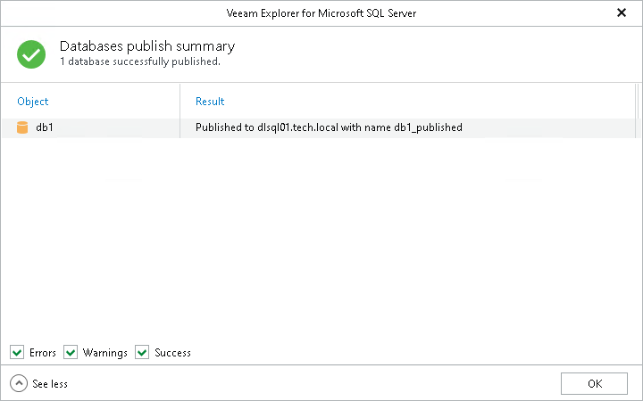

# Step 4. Review Publish Summary

At the Databases publish summary step, click See more to expand the window and review details of the publishing operation.

You can filter notifications by their status: Error, Warning or Success.

