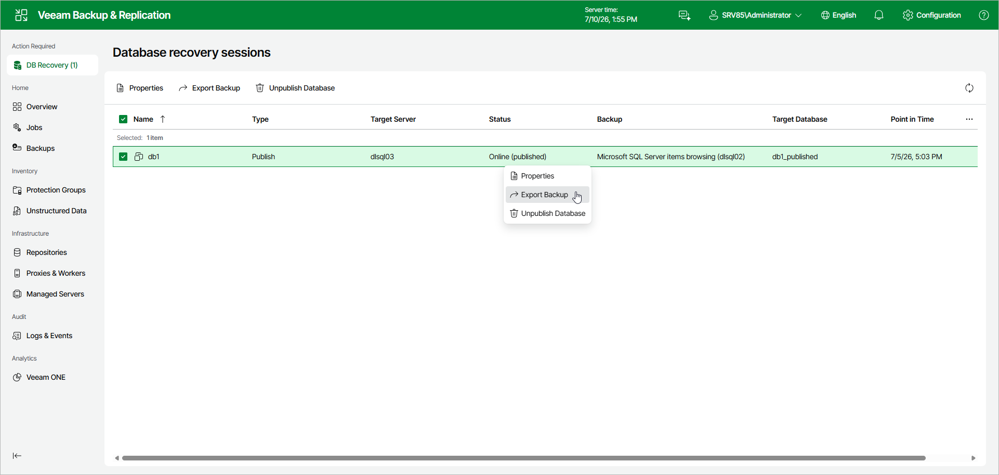
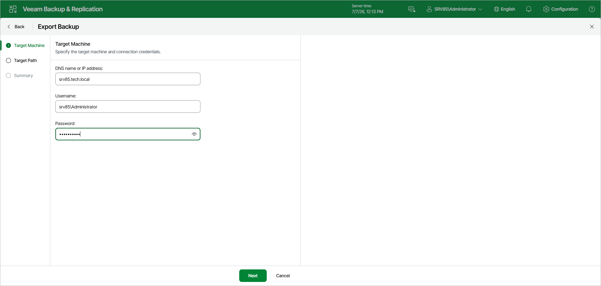
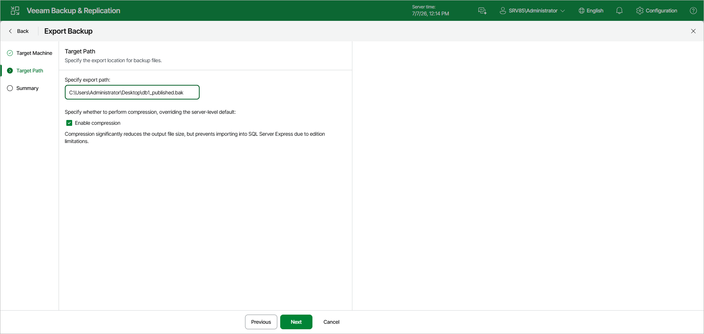
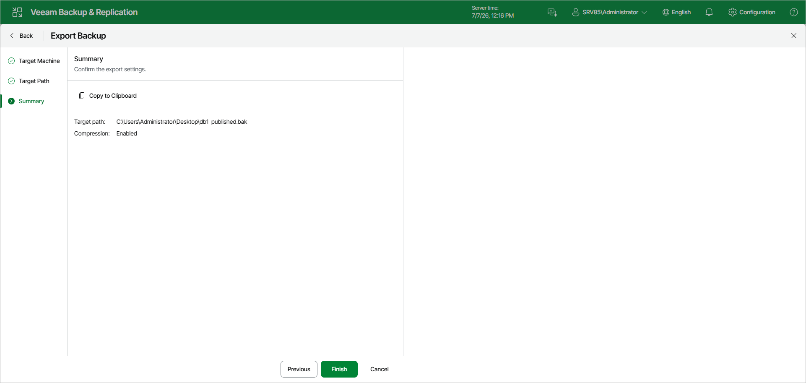

# Exporting as BAK

To save the changes you make while working with your published database, use the export feature. It exports the modified database as BAK, preserving all changes made during the publishing session.

To launch the Export Backup wizard, do the following:

1. In the Database recovery sessions view, select a publishing session.
2. Click Export Backup.

Alternatively, you can right-click the publishing session and select Export Backup.

In the Export Backup wizard, perform the following steps:

1. At the Target Machine step, specify the DNS name or IP address of the target Windows server and the credentials of an account that can access it.

1. At the Target Path step, specify the path to the export file. To reduce the output file size, select the Enable compression check box.

|  |
| --- |
| Note |
| Consider the following:   * Make sure the account you use has at least Read and Write permissions on the target directory. * Compression is unavailable if the staging SQL server runs any Express Edition of Microsoft SQL Server. |

1. At the Summary step, review the export settings and click Finish. To copy the summary to the clipboard, click Copy to Clipboard.

After you finish the steps of the Export Backup wizard, Veeam Explorer for Microsoft SQL Server starts an export session. For information on how to track this session, see [Viewing Export Session](vesql_export_web_ui_manage_properties.md).

Page updated 2026-07-10

