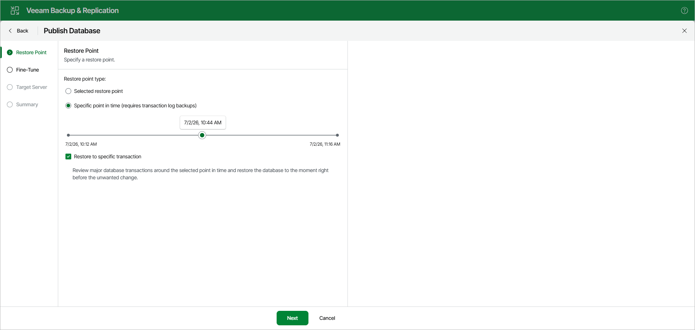

# Step 2. Specify Restore Point

At the Restore Point step, select a state as of which you want to publish your database:

* Select the Selected restore point option to load database files as of the moment when the current restore point was created.

* Select the Specific point in time option to load database files as of the selected point in time. Use the slider to choose the point in time you need.

Note that this option is available only if transaction log backups exist. For more information, see [Required Job Settings](vesql_bu_job_settings.md).

* Select the Restore to specific transaction check box to load database files exactly as of the moment before undesired transactions.

|  |
| --- |
| Note |
| The Restore to specific transaction option requires a staging SQL server. For more information, see [Configuring Staging SQL Server](vesql_configure_staging_web_ui.md). |

Page updated 2026-07-07

