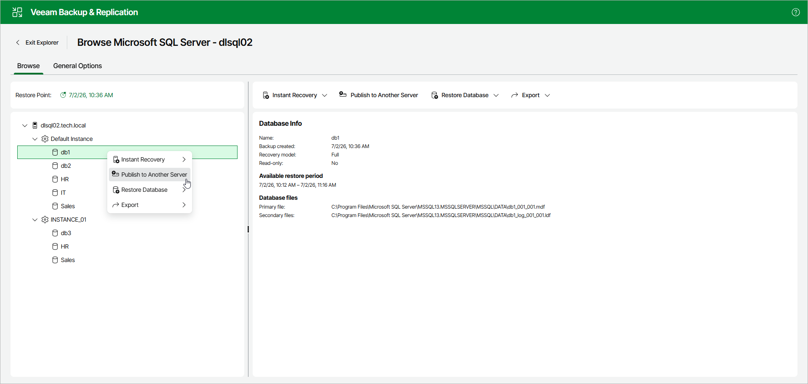
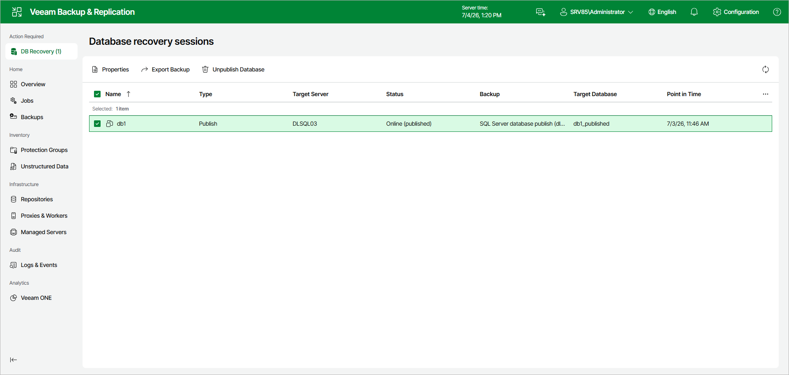
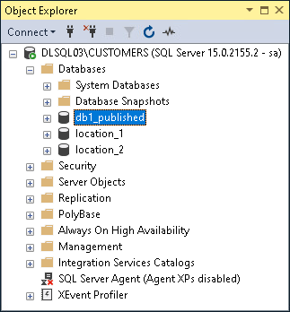

# Step 1. Launch Publish Database Wizard

To launch the Publish Database wizard, open the Browse tab and do the following:

1. In the navigation pane, select a database.
2. In the upper part of the preview pane, select Publish to Another Server.

Alternatively, you can open the Browse tab, right-click a database and select Publish to Another Server.

After you complete the wizard steps, a new Published databases node appears at the top of the navigation pane. Under this node, you can find the databases that have been published during the current session of Veeam Explorer for Microsoft SQL Server.

To work with published databases, open a SQL tool you prefer, for example, Microsoft SQL Server Management Studio and locate your published databases.

The figure below demonstrates a published database (db1\_published) available in the Object Explorer window of your Microsoft SQL Server Management Studio console. This database is also being referenced in the Veeam Backup & Replication web UI, under the DB Recovery node.

Page updated 2026-07-08

