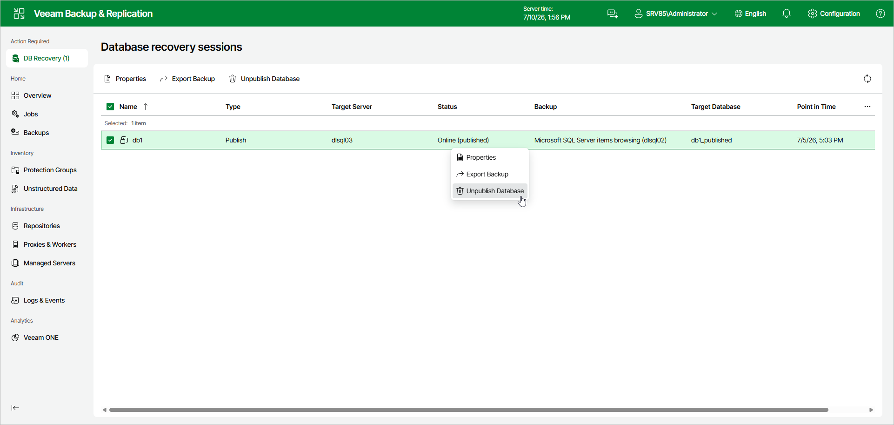

# Unpublishing Databases

After you finish working with published SQL databases, you can unpublish (detach) these databases from the target SQL server.

This will dismount the mount points from under the C:\VeeamFLR directory.

To unpublish one or multiple databases, do the following:

1. In the Database recovery sessions view, select a publishing session.
2. Click Unpublish Database.

Alternatively, right-click a publishing session and select Unpublish Database.

Page updated 2026-07-10

