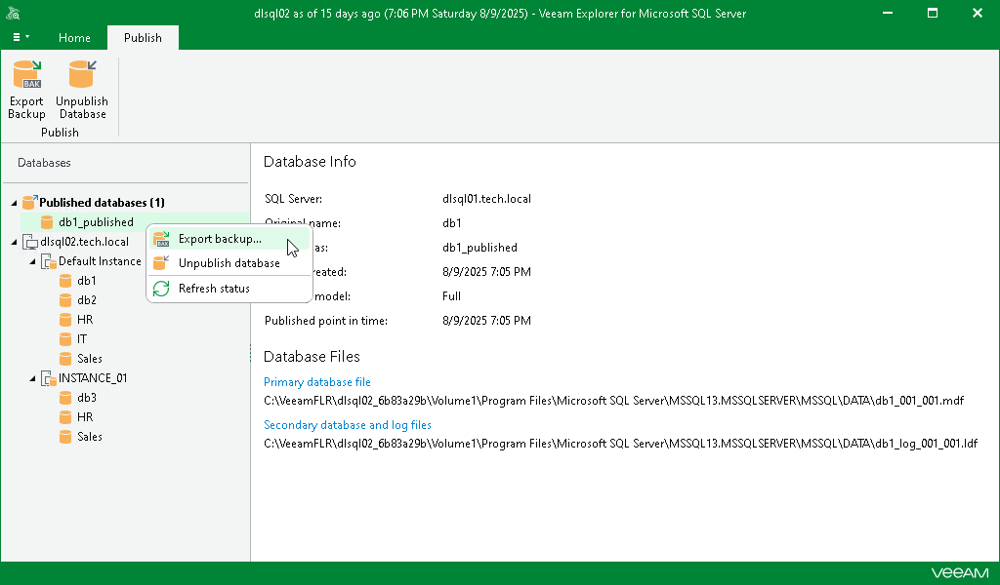
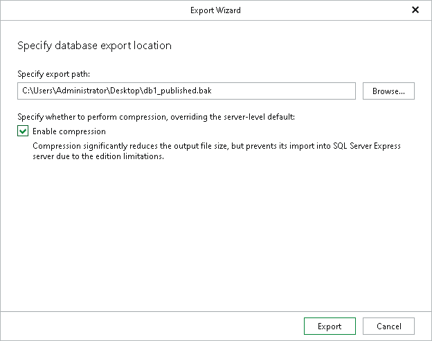
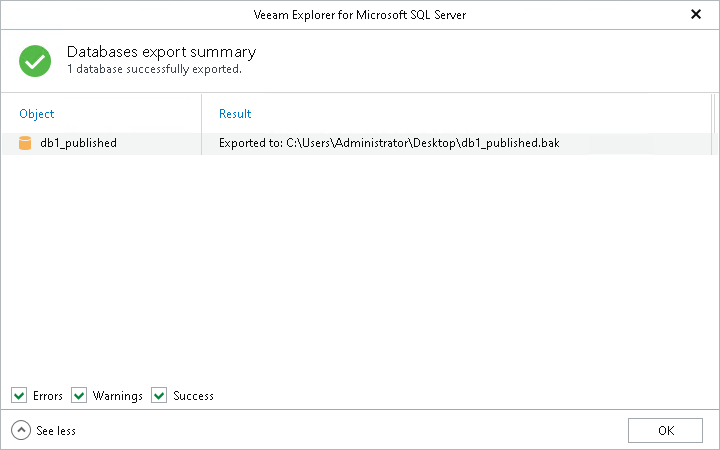

# Exporting as BAK

To save changes that have been made while working with your published database to a local computer, you can use the export feature. This feature will export modified databases as BAK, preserving all the changes that have been made during the publishing session.

To export a published database, do the following:

1. In the navigation pane, under the Published databases node, select a published database.
2. On the Publish tab, select Export backup or you can right-click a database and select Export backup.

1. In the Export wizard, specify the export path.

1. In the Specify export path field, enter the path of the BAK file. Alternatively, you can click Browse to specify the location where to export your data.

1. Select the Enable compression check box to compress the exported database. Compression will be applied according to configuration of the SQL server to which the database is published.

|  |
| --- |
| Note |
| Compression is unavailable if the server to which the database is published runs any Express Edition of Microsoft SQL Server. |

1. Click Export.

1. After the export process is complete, review the results shown in the Databases export summary window. To do this, click See more to expand the window and review details of the export operation.

You can filter notifications by their status: Error, Warning or Success.

