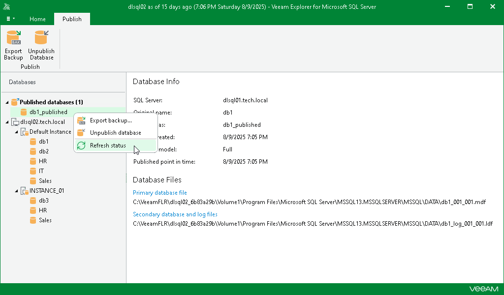

# Refreshing Database Status

In this article

While the databases are attached to the target SQL server, Veeam Explorer for Microsoft SQL Server synchronizes each published database state to verify its availability. By default, synchronization occurs every 5 seconds.

If something went wrong with any of the published databases, the question mark appears next to each of such databases indicating the database unavailability. In the Database Info section, you will also see the notification message describing the problem.

To refresh a published database state manually, in the navigation pane, under the Published databases node, right-click a published database and select Refresh status.

Page updated 8/24/2025

Page content applies to build 13.0.1.1071
