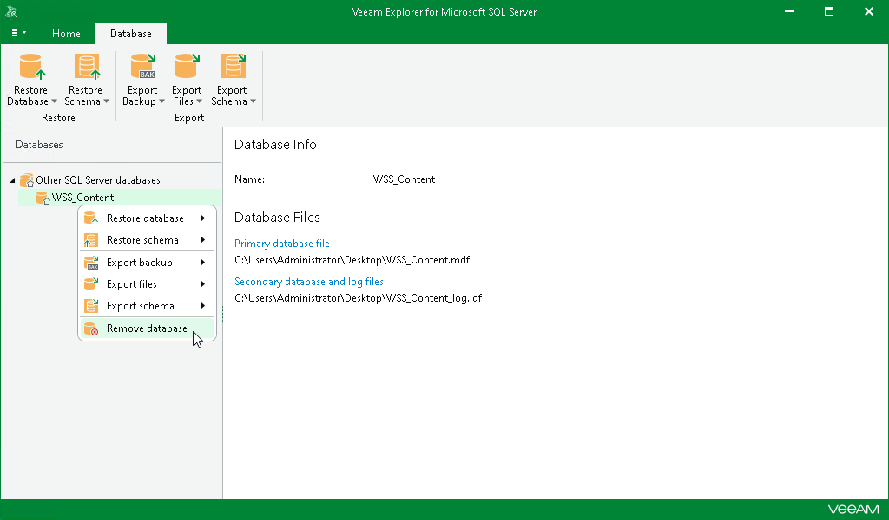

# Removing Standalone Databases

To remove a database from the application scope, right-click a database in the navigation pane and select Remove database or select a database in the navigation pane and click Remove Database on the Home tab.

|  |
| --- |
| Note |
| You can only remove databases that have been added to the application scope manually. |

