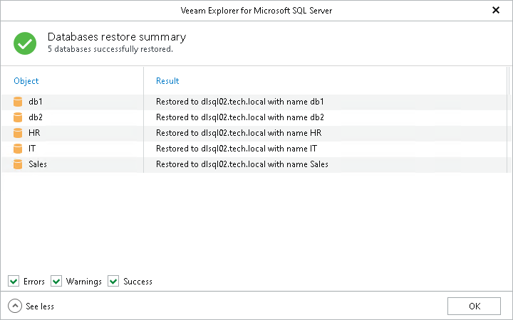

# Step 5. Review Restore Summary

At the Databases restore summary step, click See more to expand the window and review details of the restore operation.

You can filter notifications by their status: Error, Warning or Success.

