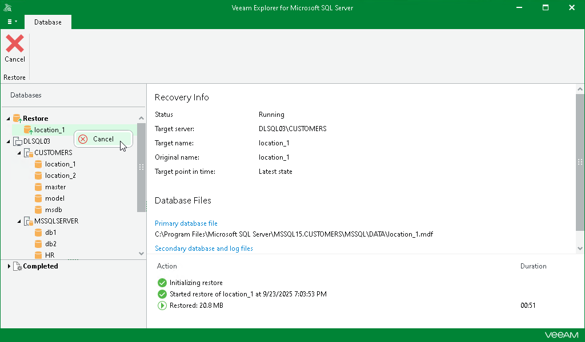

# Canceling Restore

After you finish the steps of the Restore wizard, Veeam Explorer for Microsoft SQL Server starts a restore session.

Under the Restore node in the upper part of the navigation pane, you can find ongoing restore sessions. Click a restore session to get a more detailed overview in the preview pane.

If your Microsoft SQL Server data is successfully restored or the restore session is canceled, the session moves to the Completed node in the bottom section of the navigation pane.

To cancel one or all ongoing restore sessions, do the following:

1. In the navigation pane, click the Restore node to select all ongoing restore sessions, or select a restore session.
2. On the Restore tab in the ribbon menu, select Cancel.

Alternatively, you can right-click the Restore node or the relevant restore session in the navigation pane and select Cancel.

