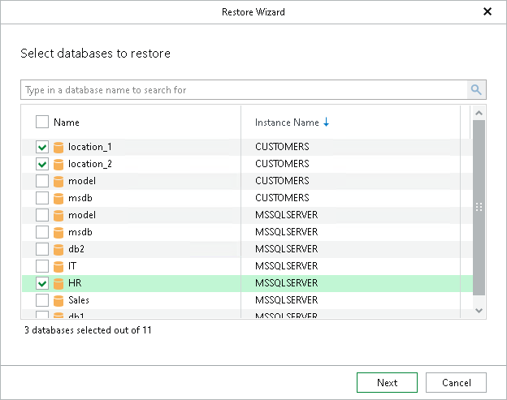

# Step 2. Select Databases

In this article

At this step of the wizard, select the databases that you want to restore.

To quickly find the necessary databases, use the search field or sort the databases by name. If the databases belong to multiple instances, you can also sort the databases by instance name.

|  |
| --- |
| Note |
| You cannot select the master database when restoring multiple databases. Use the single database restore instead. |

Page updated 9/22/2025

Page content applies to build 13.0.1.1071
