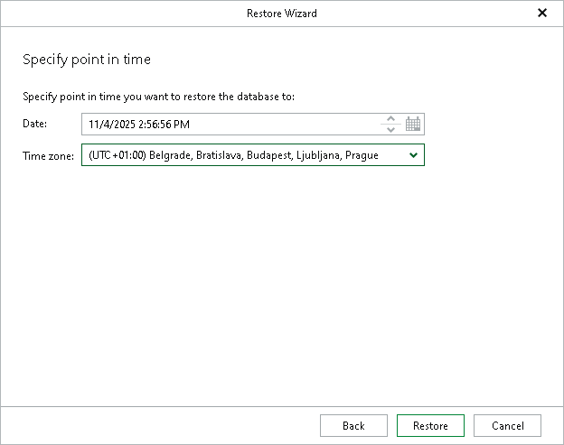

# Step 3. Specify Restore Point

At this step of the wizard, select a state as of which you want to restore your databases.

1. Specify a point-in-time state as of which you want to restore your data:

1. In the Date field, specify the date and time of the state to which you want to restore your databases.
2. From the Time zone drop-down list, select the time zone for the time specified in the Date field. By default, Veeam Explorer for Microsoft SQL Server displays the time zone of the backup server.

1. Click Restore.

Before the restore process begins, you will be prompted to enter the source machine credentials.

Consider the following:

* If you specify a point in time for which none of the databases have the necessary differential and transaction log backups, you will not be able to complete the wizard.
* If you specify a point in time for which one or more databases do not have the necessary differential or transaction log backups, Veeam Explorer for Microsoft SQL Server will display a warning at the end of the wizard. These databases will not be restored. After you acknowledge the warning, the restore process will continue for the other databases you selected.

