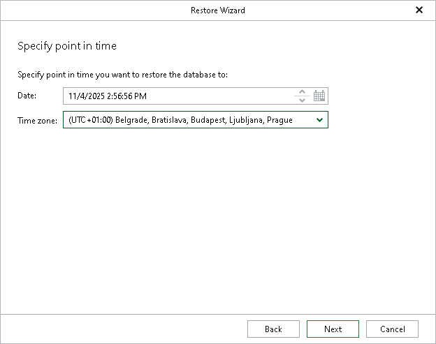

# Step 3. Specify Restore Point

In this article

At this step of the wizard, select a state as of which you want to restore your database:

1. In the Date field, specify the date and time of the state to which you want to restore your databases.
2. From the Time zone drop-down list, select the time zone for the time specified in the Date field. By default, Veeam Explorer for Microsoft SQL Server displays the time zone of the backup server.

Consider the following:

* If you specify a point in time for which none of the databases have the necessary differential or transaction log backups, you will not be able to continue with the wizard.
* If you specify a point in time for which one or more databases do not have the necessary differential or transaction log backups, Veeam Explorer for Microsoft SQL Server will display a warning at the end of the wizard. These databases will not be restored. After you acknowledge the warning, the restore process will continue for the other databases you selected.

Page updated 11/12/2025

Page content applies to build 13.0.1.1071
