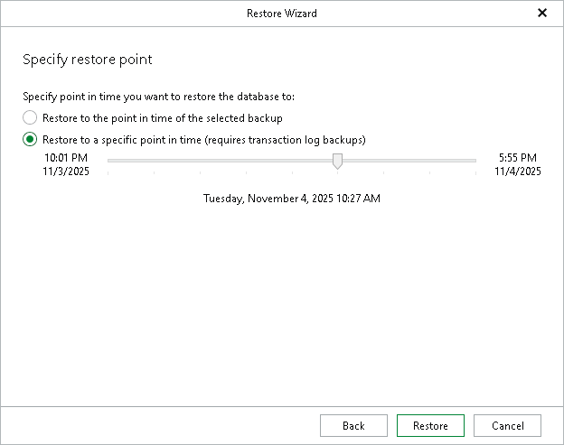

# Step 3. Specify Point-in-Time State

In this article

At this step of the wizard, specify a point-in-time state to which you want to restore your database. To do this, specify one of the following options:

1. Choose a point in time:

* Select the Restore to the point in time of the selected backup option to load database files as of the moment when the current restore point was created.
* Select the Restore to a specific point in time option to load database files as of the specified point in time. Use the slider to choose the point in time you need.

This option is available in case the following conditions are met:

* The backup contains Microsoft SQL Server transaction logs.
* The recovery model for the database is set to full or bulk-logged.

1. Click Restore.

|  |
| --- |
| Note |
| This step of the wizard is not available when you restore the master database. Point-in-time restore relies on transaction log backups, which are not supported for the master database. |

Before the restore process begins, you will be prompted to enter the source machine credentials.

Page updated 11/12/2025

Page content applies to build 13.0.1.1071
