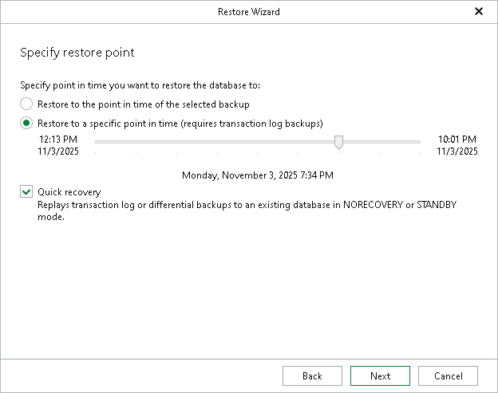

# Step 3. Specify Point-in-Time State

At this step of the wizard, select a state as of which you want to restore your database:

* Select the Restore to the point in time of the selected backup option to load database files as of the moment when the current restore point was created.

* Select the Restore to a specific point in time option to load database files as of the selected point in time. Use the slider to choose the point in time you need.

This option is available in case the following conditions are met:

* The backup contains Microsoft SQL Server transaction logs.
* The recovery model for the database is set to full or bulk-logged.

* Select the Quick recovery check box to replay transaction log or differential backups to an already existing database which is configured in the NORECOVERY or STANDBY mode.

This check box is not available and grayed out if you selected a full backup at the previous step of the wizard and selected the Restore to the point in time of the selected backup option.

|  |
| --- |
| Note |
| This step of the wizard is not available when you restore the master database. Point-in-time restore relies on transaction log backups, which are not supported for the master database. |

