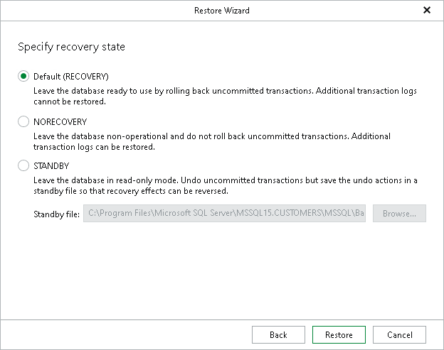

# Step 6. Specify Recovery State

At this step of the wizard, select a recovery state for the database.

1. Choose a recovery state:

* Default (RECOVERY)

Rolls back (undo) any uncommitted changes.

* NORECOVERY

Skips the undo phase so that uncommitted or incomplete transactions are held open.

This allows further restore stages to carry on from the restore point. When applying this option, the database will be in a norecovery state and inaccessible to users.

* STANDBY

The database will be in standby state and therefore available for read operations. You can also provide a standby file with uncommitted transactions.

1. Click Restore.

For more information on recovery states, see [this Microsoft article](https://learn.microsoft.com/en-us/sql/relational-databases/backup-restore/restore-database-options-page?view=sql-server-ver16#recovery-state).

|  |
| --- |
| Note |
| This step of the wizard is not available when you restore the master database. The database will be automatically restored with the default (RECOVERY) restore option. |

