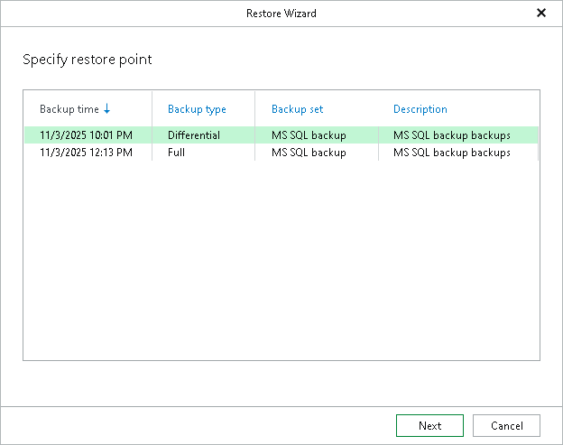

# Step 2. Specify Restore Point

At this step of the wizard, select a restore point from which you want to restore your database.

To quickly find the necessary restore point, you can sort the restore points according to the backup time, backup type, the backup set to which they belong and the description.

|  |
| --- |
| Note |
| When you restore the master database, only full backups are available. Differential backups rely on transaction log backups, which are not supported for the master database. |

