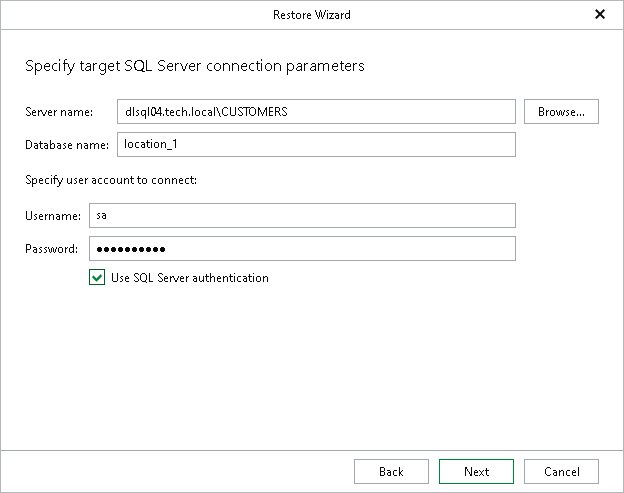
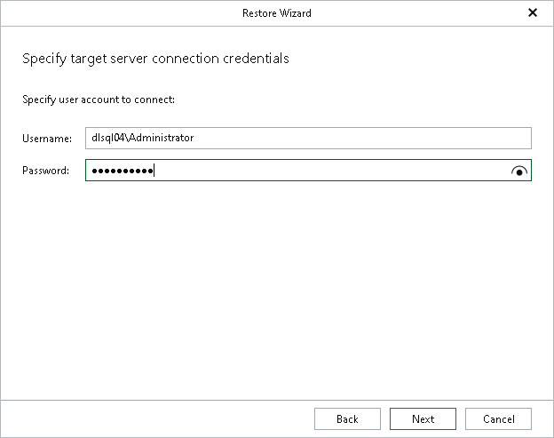

# Step 4. Specify Target Server

At this step of the wizard, do the following:

1. In the Server name field, specify the Microsoft SQL Server machine or instance to which you want to restore your database.

Use the <IP address\instance> or <hostname\instance> format. You can select a server or instance from the drop-down list or use the Browse button, as described in [Browsing for Servers](#bfs).

If the SQL Server instance is assigned a custom port, and Microsoft SQL Browser is not running on the machine, specify the instance port in the following format: <IP address or hostname>,<port>.

1. In the Database name field, specify a name for the restored database.
2. In the Specify user account to connect section specify the user name and password for the account used to authenticate to Microsoft SQL Server on the target server.

Select the Use SQL Server authentication check box to use Microsoft SQL Server authentication. If you do not select the check box, Veeam Explorer for Microsoft SQL Server will use Windows authentication. Note that SQL Server authentication is not available when you restore the master database.

If you select the Use SQL Server authentication check box and provide SQL Server credentials, proceed to the next step of the wizard where you specify the user name and password for the account used to authenticate to the target server.

Browsing for Servers

To browse for a Microsoft SQL Server instance, perform one of the following actions:

* On the Local Servers tab, choose a Microsoft SQL Server instance that is located on the machine where Veeam Explorer for Microsoft SQL Server is opened and click Select.
* On the Network Servers tab, choose a Microsoft SQL Server instance available over the network and click Select.

