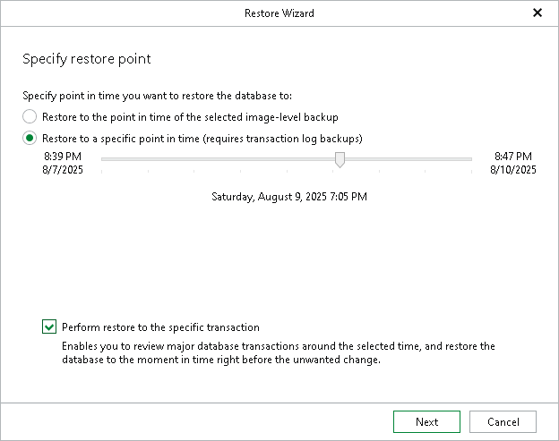

# Step 2. Specify Restore Point

At this step of the wizard, select a state as of which you want to restore your database:

* Select the Restore to the point in time of the selected image-level backup option to load database files as of the moment when the current restore point was created.

* Select the Restore to a specific point in time option to load database files as of the selected point in time. Use the slider to choose the point in time you need.

Note that this option is available only if transaction log backups exist. For more information, see [Required Job Settings](vesql_bu_job_settings.md).

* Select the Perform restore to the specific transaction check box to load database files exactly as of the moment before undesired transactions.

|  |
| --- |
| Note |
| The Perform restore to the specific transaction option requires a staging Microsoft SQL Server. For more information, see [Configuring Staging SQL Server](vesql_configure_staging.md). |

