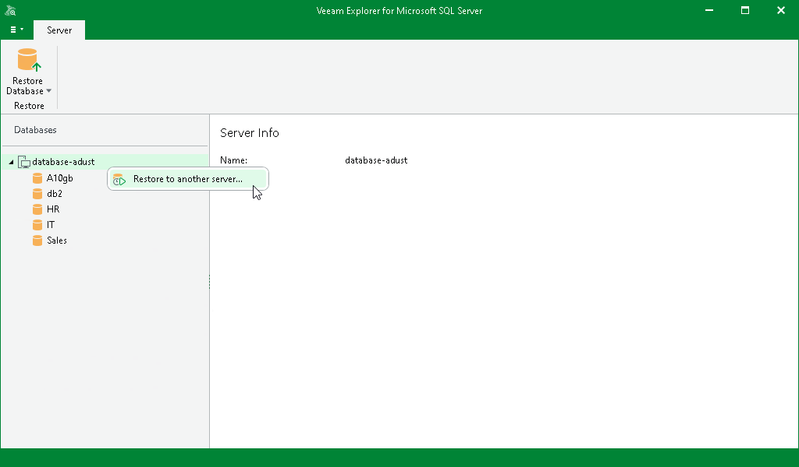

# Step 1. Launch Restore Wizard

To launch the Restore wizard, do the following:

1. In the navigation pane, select an instance or server.
2. On the Instance or Server tab, select Restore Database > Restore to another server.

Alternatively, you can right-click an instance or the server and select Restore to another server.

All databases will be restored to the latest available full restore point.

Page updated 2026-04-02

