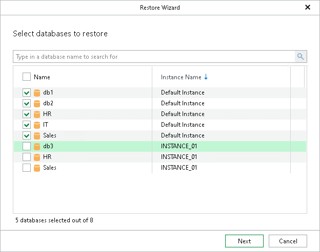

# Step 2. Select Databases

At this step of the wizard, select the databases that you want to restore.

To quickly find the necessary databases, use the search field or sort the databases by name. If the databases belong to multiple instances, you can also sort the databases by instance name.

