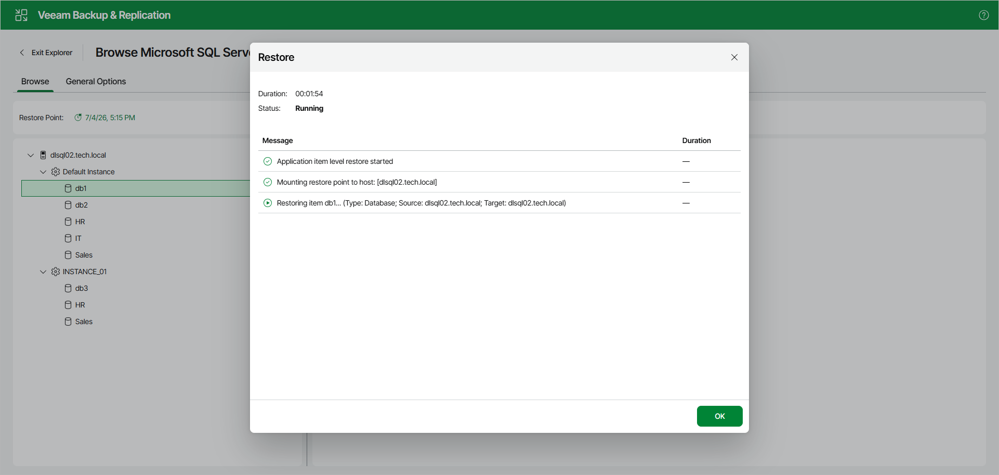
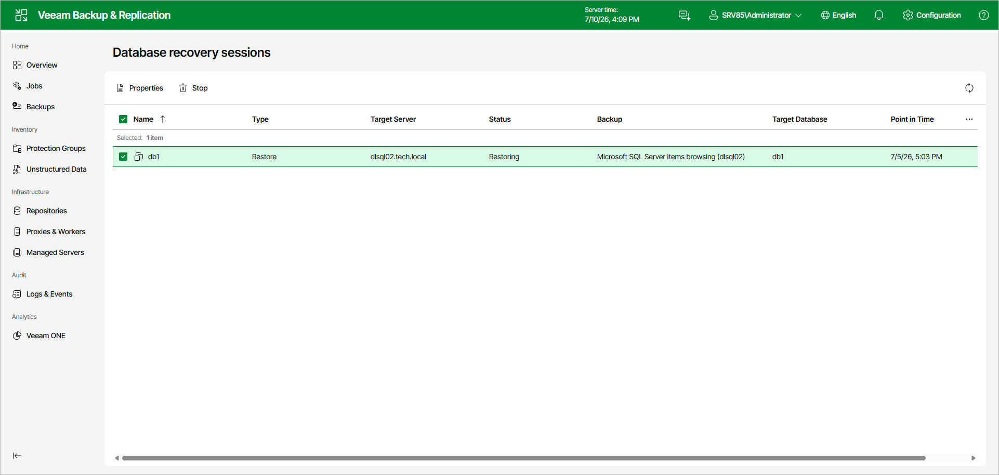

# Managing Restore Session

After you finish the steps of the Restore Databases wizard, Veeam Explorer for Microsoft SQL Server starts a restore session that shows the progress of the operation.

Note that clicking OK or closing the session window does not interrupt the operation.

You can manage and track the session progress in the Veeam Backup & Replication web UI.

To do this, open the Veeam Backup & Replication web UI and in the management pane, click DB Recovery.

In the Database recovery sessions view, you can find ongoing recovery sessions.

For ongoing restore sessions, you can do the following:

* [View restore session details](vesql_restore_web_ui_manage_properties.md).
* [Stop the restore session](vesql_restore_web_ui_manage_stop.md).

Page updated 2026-07-10

