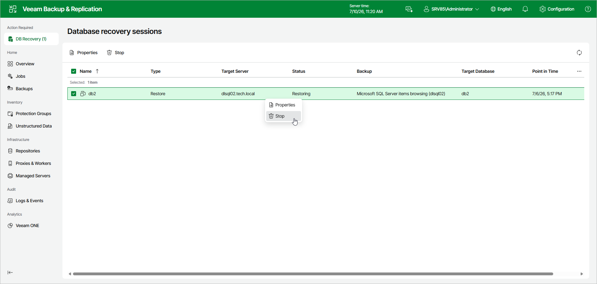

# Stopping Restore Session

If you do not want to proceed with the restore operation, you can stop the restore session.

To stop the restore session, do the following:

1. In the Database recovery sessions view, select a restore session.
2. Click Stop.

Alternatively, right-click the session and select Stop.

Page updated 2026-07-13

