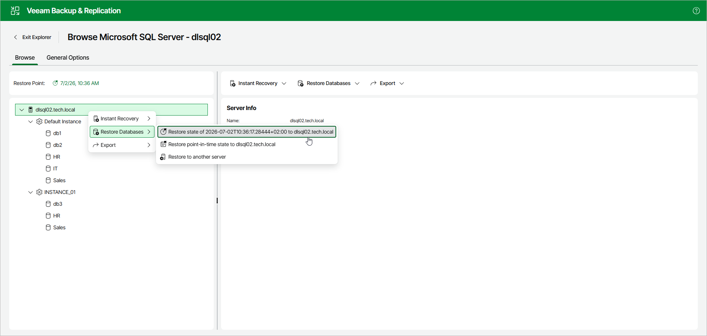

# Step 1. Launch Restore Wizard

To launch the Restore wizard, open the Browse tab and do the following:

1. In the navigation pane, select an instance or the server.
2. In the upper part of the preview pane, select Restore Databases > Restore latest state to <original\_location>.

Alternatively, you can open the Browse tab, right-click an instance or the server and select Restore Databases > Restore latest state to <original\_location>.

|  |
| --- |
| Note |
| The name of the restore option depends on the selected restore point.   * If you select the most recent available restore point, the option name is displayed as Restore latest state to <original\_location>. * If you select any other restore point, the option name is displayed as Restore state of <point\_in\_time> to <original\_location>. |

Page updated 2026-07-11

