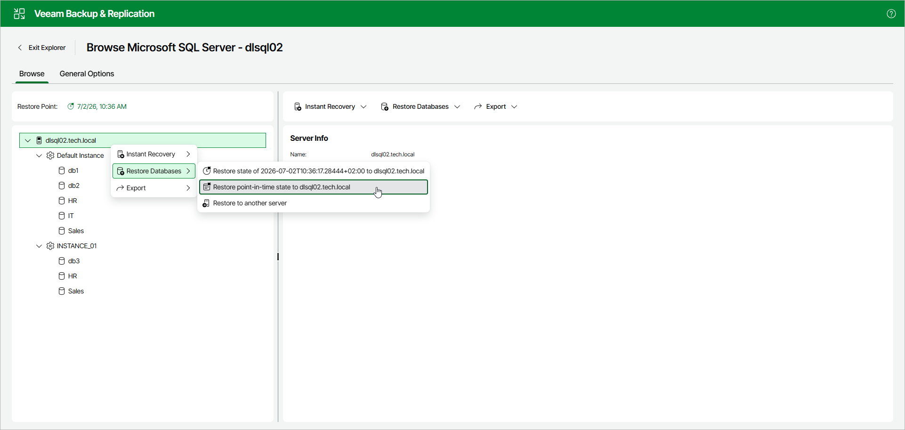

# Step 1. Launch Restore Wizard

To launch the Restore wizard, open the Browse tab and do the following:

1. In the navigation pane, select an instance or the server.
2. In the upper part of the preview pane, select Restore Databases > Restore point-in-time state to <original\_location>.

Alternatively, you can open the Browse tab, right-click an instance or the server and select Restore Databases > Restore point-in-time state to <original\_location>.

Page updated 2026-07-08

