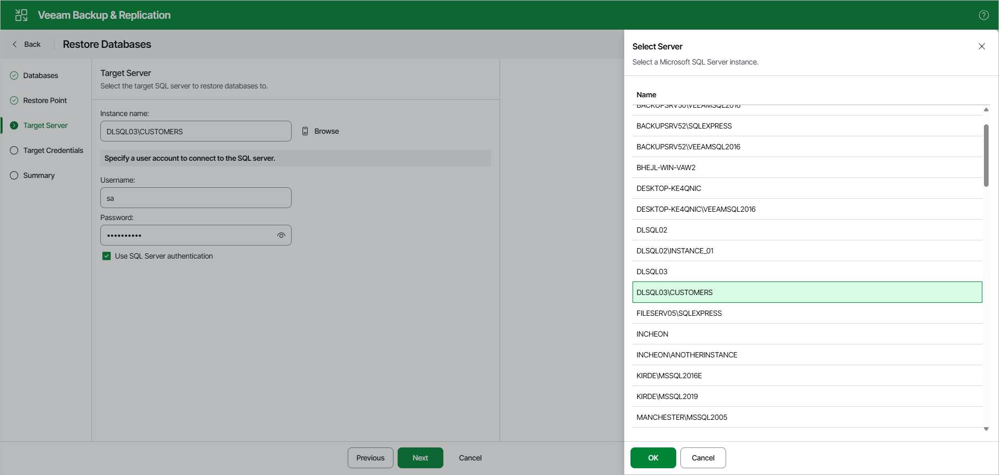
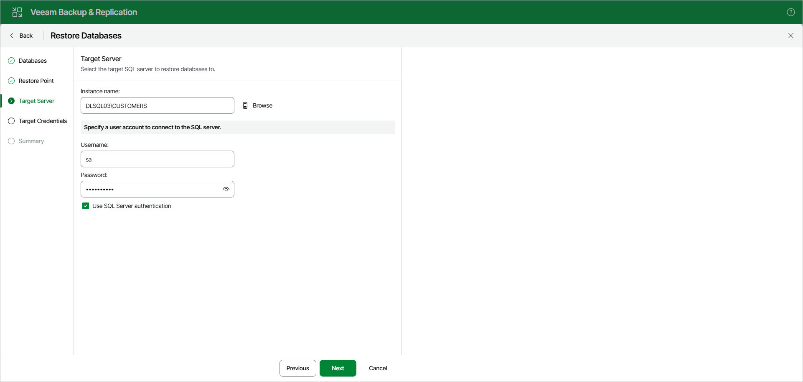
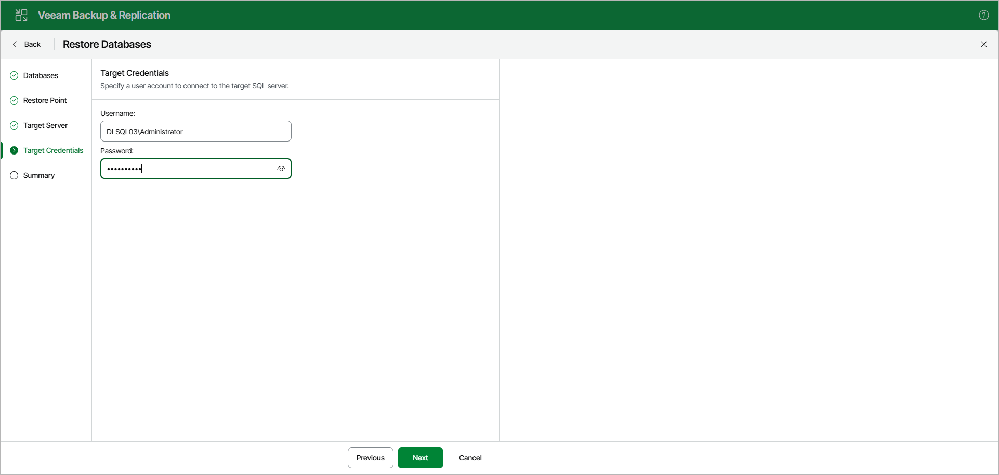

# Step 4. Specify Target Server

At the Target Server step, do the following:

1. In the Instance name field, specify the Microsoft SQL Server instance to which you want to restore the databases.

Use the <IP address\instance> or <hostname\instance> format. If the SQL Server instance is assigned a custom port, and Microsoft SQL Browser is not running on the machine, specify the instance port in the following format: <IP address or hostname>,<port>.

You can click Browse to open the Select Server window and browse through the list of instances available over the network.

Select a Microsoft SQL Server instance and click OK.

When you restore multiple databases, Veeam Explorer for Microsoft SQL Server places database files to their default location specified in the properties of the target SQL Server instance.

1. In the Specify a user account to connect to the SQL server section, provide a user name and password to connect to the target instance. You can use Windows or SQL authentication.

* To use Windows authentication, specify the credentials of an account with the sysadmin role on the target Microsoft SQL Server machine. These credentials are used to connect to the guest OS and the SQL instance.
* To use SQL authentication, select the Use SQL Server authentication check box. Provide SQL credentials to connect to the target instance.

If you use SQL authentication, you will get the Target Credentials step.

Specify the credentials of an account that can access the guest OS on the target server.

Page updated 2026-07-11

