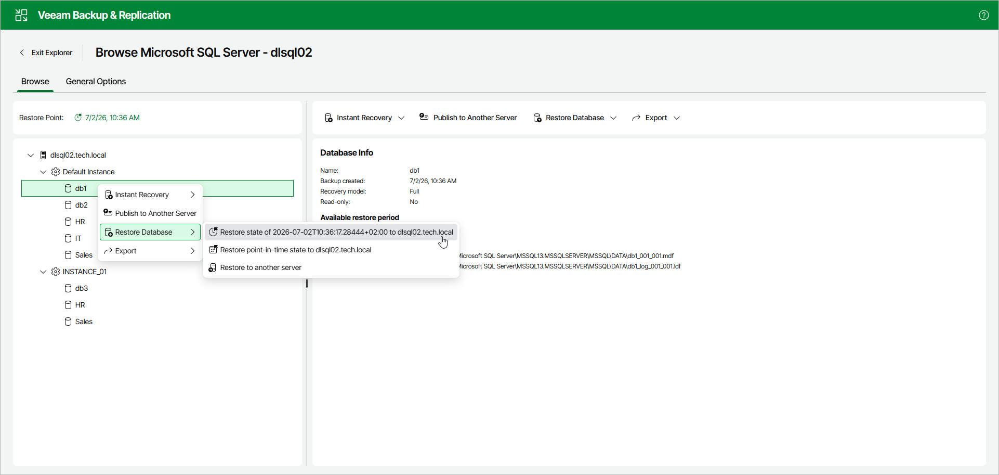

# Restoring Latest State

You can restore a Microsoft SQL Server database as of the latest state of the restore point.

The data will be restored in the following manner:

* Database files will be mounted to the original Microsoft SQL Server machine and copied to the original location.
* If a database with the same name already exists on a target Microsoft SQL Server machine, you will be prompted to overwrite the database with that from the backup file.

To restore the latest available state of a Microsoft SQL Server database, open the Browse tab and do the following:

1. In the navigation pane, select a database.

You can select the root instance node to restore all the available databases at once.

1. In the upper part of the preview pane, select Restore Database > Restore latest state to <original\_location>.

Alternatively, you can open the Browse tab, right-click a database and select Restore database > Restore latest state to <original\_location>.

|  |
| --- |
| Note |
| The name of the restore option depends on the selected restore point.   * If you select the most recent available restore point, the option name is displayed as Restore latest state to <original\_location>. * If you select any other restore point, the option name is displayed as Restore state of <point\_in\_time> to <original\_location>. |

Page updated 2026-07-11

