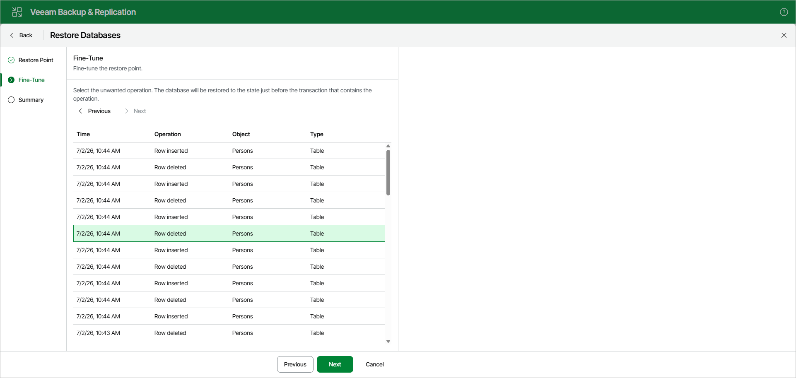

# Step 3. Fine-Tune Restore Point

At the Fine-Tune step, select an operation prior to which you want to restore your database.

Veeam Explorer for Microsoft SQL Server database operations are listed in the [SQL Server Database Operations](vesql_operations.md) section.

|  |
| --- |
| Note |
| This step is available only if you have selected the Restore to specific transaction check box at the [Specify Restore Point](vesql_restore_web_ui_single_pit_restore_point.md) step. |

Page updated 2026-07-07

