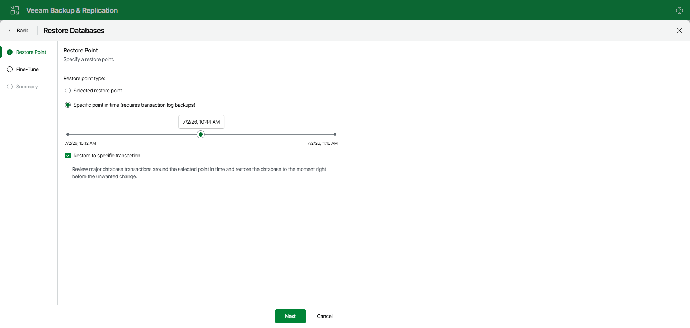

# Step 2. Specify Restore Point

At the Restore Point step, specify a state to which you want to restore your database.

Select one of the following options:

* Selected restore point. Select this option to load database files as of the moment when the current restore point was created.
* Specific point in time. Select this option to load database files as of the selected point in time. Use the slider to choose the point in time you need.

This option is available in case the following conditions are met:

* [For restore from a backup created by a backup job] The backup is created by a job that is set to back up transaction logs or process transaction logs in the copy only mode.
* [For restore from a backup created by a backup copy job] The backup is created by a job that is set to process transaction logs.

* The recovery model for the database is set to full or bulk-logged.

[Optional] Select the Restore to specific transaction check box to load database files exactly as of the moment before undesired transactions. If you select this option, you will be able to specify an exact transaction at the [next step](vesql_restore_web_ui_single_pit_fine_tune.md).

This option requires a staging Microsoft SQL Server. For more information, see [Configuring Staging SQL Server](vesql_configure_staging_web_ui.md).

This option is unavailable when restoring multiple databases.

Page updated 2026-07-11

