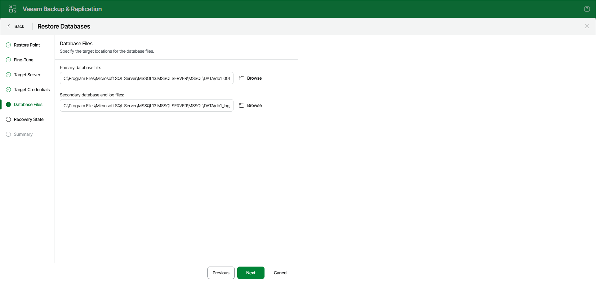
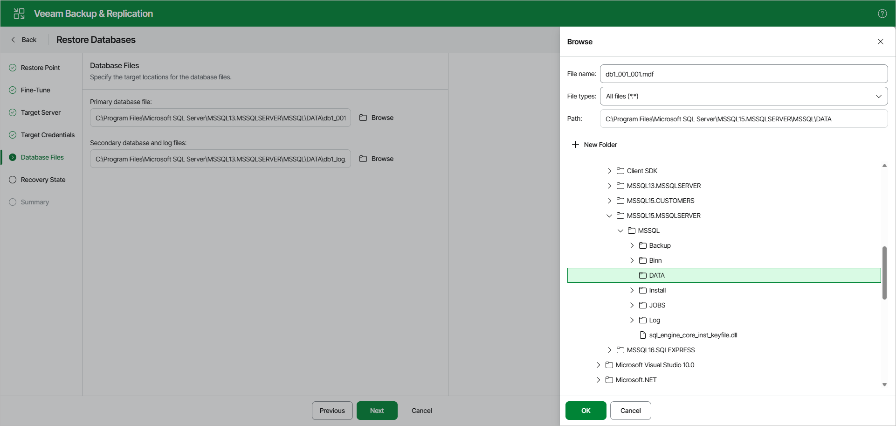

# Step 6. Specify Files Location

At the Database Files step, specify the following file locations.

* Primary database file
* Secondary database and log files
* BLOB stores (if necessary)

|  |
| --- |
| Note |
| Make sure the account you are using has Read and Write permissions. |

To specify a file location, do the following:

1. Click Browse next to the necessary database file type.

1. In the Browse window, select a database file or folder for the restored database and click OK. To create a new folder, click New Folder.

[For restore to another location] To prevent you from storing BLOBs from different databases in the same directory, Veeam Explorer for Microsoft SQL Server supports creating a BLOB stores folder using the Restore wizard only. If you select an already existing folder, Veeam Explorer for Microsoft SQL Server will display an error.

Page updated 2026-07-07

