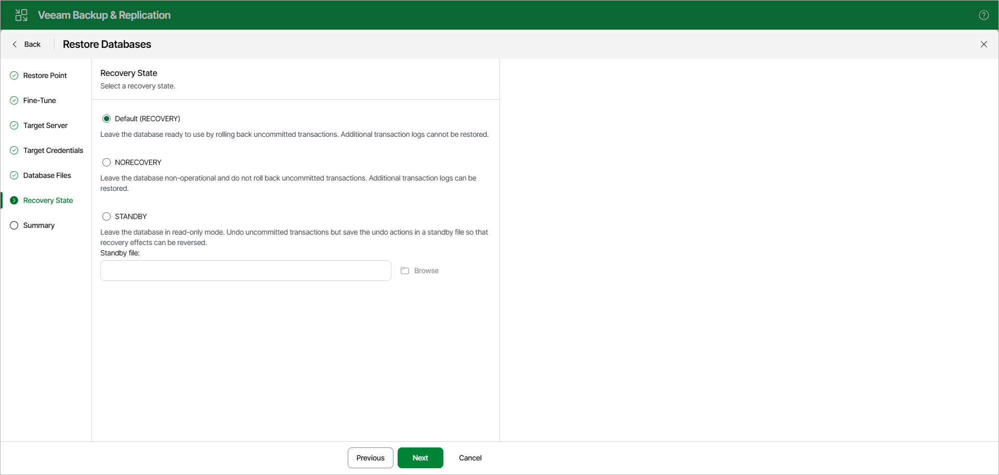

# Step 7. Specify Recovery State

At the Recovery State step, select a recovery state for the database:

* Default (RECOVERY)

Rolls back (undo) any uncommitted changes.

* NORECOVERY

Skips the undo phase so that uncommitted or incomplete transactions are held open.

This allows further restore stages to carry on from the restore point. When applying this option, the database will be in a norecovery state and inaccessible to users.

* STANDBY

The database will be in standby state and therefore available for read operations. You can also provide a standby file with uncommitted transactions.

For more information on recovery states, see [this Microsoft article](https://learn.microsoft.com/en-us/sql/relational-databases/backup-restore/restore-database-options-page?view=sql-server-ver16#recovery-state).

|  |
| --- |
| Note |
| This step is unavailable if the Add database to following Availability Group check box is selected at the [Specify Always On Restore Options](vesql_restore_web_ui_single_tas_always_on.md) step. |

Page updated 2026-07-07

