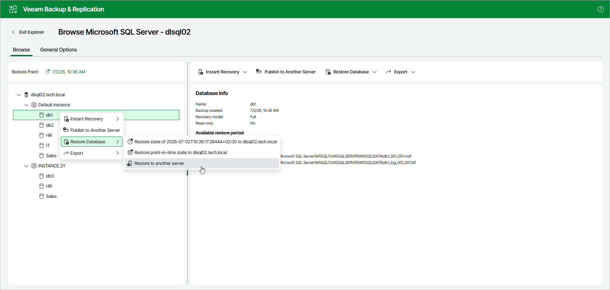

# Step 1. Launch Restore Wizard

To launch the Restore wizard, open the Browse tab and do the following:

1. In the navigation pane, select a database.
2. In the upper part of the preview pane, select Restore Database > Restore to another server.

Alternatively, you can open the Browse tab, right-click a database and select Restore Database > Restore to another server.

Page updated 2026-07-08

