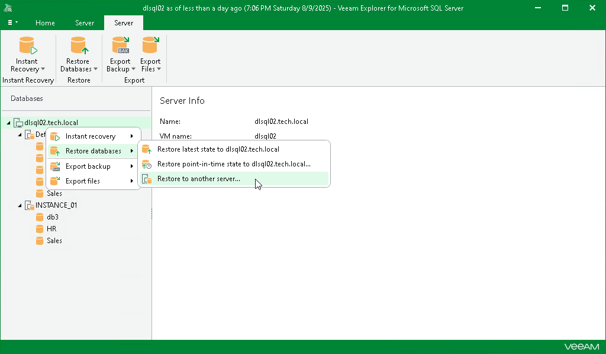

# Step 1. Launch Restore Wizard

In this article

To launch the Restore wizard, do the following:

1. In the navigation pane, select an instance or server.
2. On the Instance or Server tab, select Restore Databases > Restore to another server.

Alternatively, you can right-click an instance or the server and select Restore databases > Restore to another server.

Page updated 8/10/2025

Page content applies to build 13.0.1.1071
