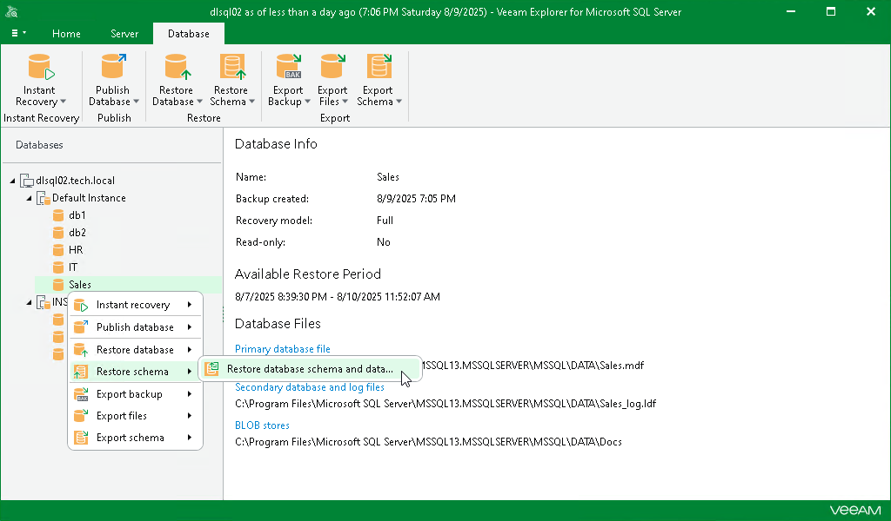

# Step 1. Launch Restore Wizard

To launch the Restore wizard, do the following:

1. In the navigation pane, select a database.
2. On the Database tab, select Restore Schema > Restore database schema and data.

Alternatively, you can right-click a database in the navigation pane and select Restore schema > Restore database schema and data.

|  |
| --- |
| Important |
| Consider the following:   * A staging SQL Server is required to restore database schema and data. For more information, see [Configuring Staging SQL Server](vesql_configure_staging.md). * FILESTREAM must be enabled on the staging SQL Server to restore file tables. For more information on enabling FILESTREAM, see [this Microsoft article](https://learn.microsoft.com/en-us/sql/relational-databases/blob/enable-and-configure-filestream?view=sql-server-ver16). |

