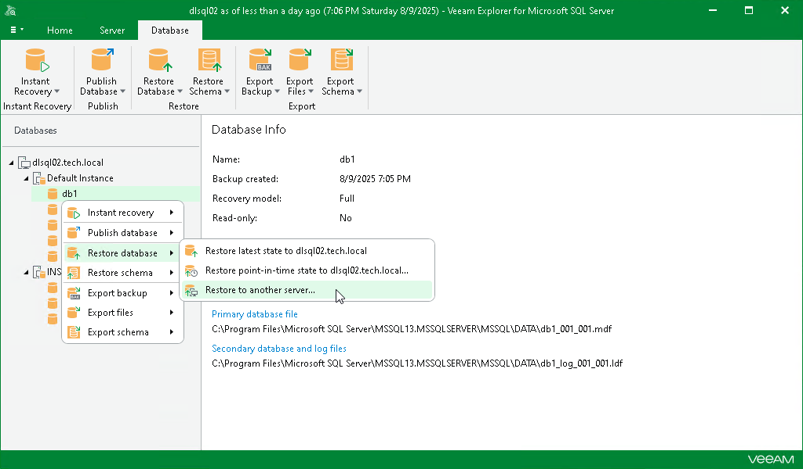

# Step 1. Launch Restore Wizard

To launch the Restore wizard, do the following:

1. In the navigation pane, select a database.
2. On the Database tab, select Restore Database > Restore to another server.

Alternatively, you can right-click a database and select Restore database > Restore to another server.

