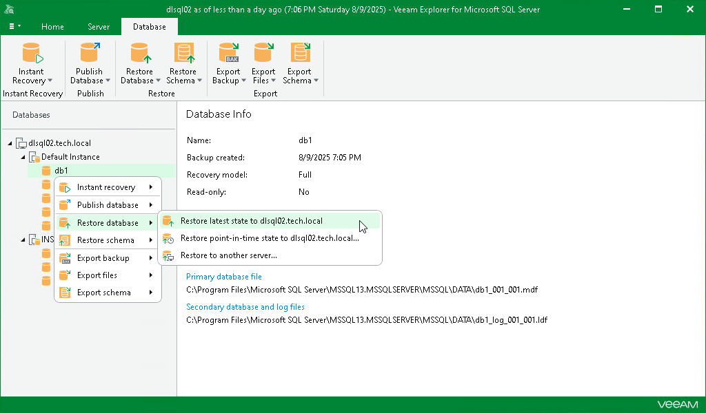
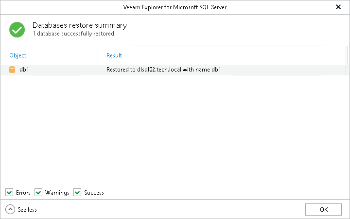

# Restoring Latest State

You can restore a Microsoft SQL Server database as of the latest state in your backup file.

The data will be restored in the following manner:

* Database files will be copied to the original location and then mounted to the original Microsoft SQL Server machine.
* If a database with the same name already exists on a target Microsoft SQL Server machine, it will be replaced with the database from a backup file.

To restore the latest available state of a Microsoft SQL Server database, do the following:

1. In the navigation pane, select a database.

You can select the root instance node to restore all the available databases at once.

1. On the Database tab, select Restore Database > Restore latest state to <original\_location>.

Alternatively, you can right-click a database and select Restore database > Restore latest state to <original\_location>.

|  |
| --- |
| Note |
| The name of the restore option depends on the restore point you select during the [application item restore](restore_veeam_explorers.md) process in the Veeam Backup & Replication console.   * If you select the most recent available restore point, the option name is displayed as Restore latest state to <original\_location>. * If you select any other restore point, the option name is displayed as Restore state of <point\_in\_time> to <original\_location>. |

Before the restore process begins, you will be prompted to enter the source machine credentials.

After the restore process is complete, review the results shown in the Databases restore summary window. To do this, click See more to expand the window and review details of the restore operation.

You can filter notifications by their status: Error, Warning or Success.

