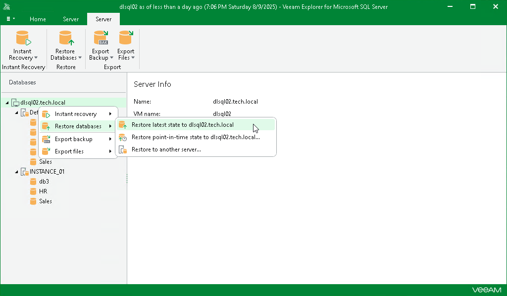

# Step 1. Launch Restore Wizard

In this article

To launch the Restore wizard, do the following:

1. In the navigation pane, select an instance or the server.
2. On the Instance or Server tab, select Restore Databases > Restore latest state to <original\_location>.

Alternatively, you can right-click an instance or the server and select Restore databases > Restore latest state to <original\_location>.

|  |
| --- |
| Note |
| The name of the restore option depends on the restore point you select during the [application item restore](restore_veeam_explorers.md) process in the Veeam Backup & Replication console.   * If you select the most recent available restore point, the option name is displayed as Restore latest state to <original\_location>. * If you select any other restore point, the option name is displayed as Restore state of <point\_in\_time> to <original\_location>. |

Page updated 8/21/2025

Page content applies to build 13.0.1.1071
