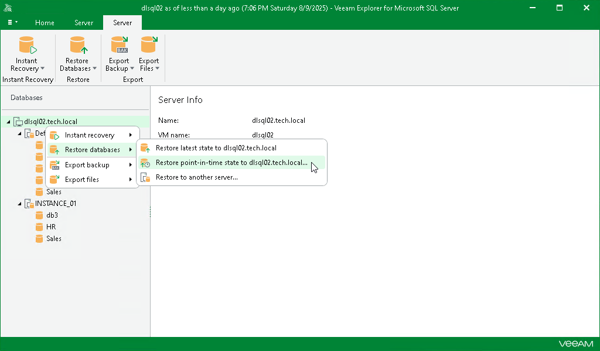

# Step 1. Launch Restore Wizard

To launch the Restore wizard, do the following:

1. In the navigation pane, select an instance or the server.
2. On the Instance or Server tab, select Restore Databases > Restore point-in-time state to <original\_location>.

Alternatively, you can right-click an instance or the server and select Restore databases > Restore point-in-time state to <original\_location>.

|  |
| --- |
| Note |
| Before the restore process begins, you will be prompted to enter the source machine credentials. |

