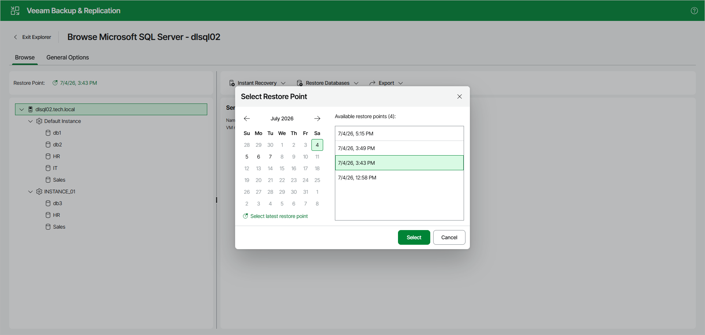

# Selecting Restore Point

This option is only available in the Veeam Explorer for Microsoft SQL Server Web UI.

To view available restore points and select a restore point that you want to use, do the following:

1. Open the Browser tab. In the Restore Point section, click the restore point timestamp.
2. In the displayed dialog box, do either of the following:

* In the calendar, click the date for which Veeam Backup & Replication has available restore points. Such dates are marked in bold. The list of available restore points for the selected date will be displayed on the right. Select one of the available restore points.
* Click Select latest restore point to select the latest restore point that is available in the backup.

1. Click Select.

Page updated 2026-07-07

